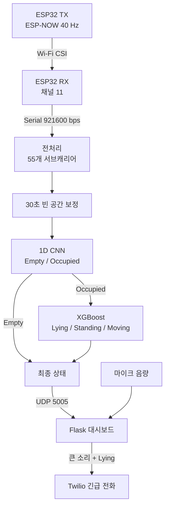

# Wi-See

> **WiFi 채널 상태 정보(CSI)를 활용한 사용자 상태 정보 추론**

Wi-See는 카메라나 웨어러블 없이 Wi-Fi CSI와 소리를 이용하여 실내 사용자의 상태를 추론하고, 낙상 의심 상황을 감지하는 비접촉 안전 모니터링 시스템입니다.

## 프로젝트 한눈에 보기

| 항목 | 내용 |
|---|---|
| 팀 | 부산대학교 정보컴퓨터공학부 캡스톤디자인 28조 `Wi-See` |
| 핵심 기능 | `Empty` · `Standing` · `Moving` · `Lying` 실시간 추론 |
| 감지 방식 | Wi-Fi CSI 기반 재실·활동 분류 + 마이크 기반 충격음 감지 |
| 하드웨어 | ESP32 송신기 1대 + 수신기 1대 |
| AI 모델 | 1단계 1D CNN + 2단계 XGBoost |
| 사용자 화면 | Flask 실시간 대시보드 |
| 긴급 알림 | 큰 소리 후 15초 이내 `Lying` 감지 시 Twilio 전화 |

## 시연 영상

[](https://youtu.be/cEhZeaYs7K8)

▶ **[YouTube에서 Wi-See 시연 영상 보기](https://youtu.be/cEhZeaYs7K8)**

## 1. 프로젝트 배경

| 문제 | 기존 방식의 한계 | Wi-See의 접근 | 기대효과 |
|---|---|---|---|
| 독거노인·1인 가구의 실내 낙상 위험 | 카메라는 사생활 침해 우려가 있음 | 영상 대신 Wi-Fi 신호 변화를 분석 | 시각적 개인정보 노출 최소화 |
| 사용자의 지속적인 상태 확인 필요 | 웨어러블은 착용과 충전이 필요함 | 공간에 설치된 ESP32로 비접촉 감지 | 사용자의 별도 조작 없이 동작 |
| 누움과 실제 낙상 상황의 구분 필요 | 단일 센서만으로는 오탐 가능성이 있음 | CSI 상태와 큰 소리 발생 시점을 함께 판단 | 낙상 의심 상황의 신뢰도 향상 |

## 2. 개발 목표 및 차별성

| 구분 | 구현 내용 |
|---|---|
| CSI 수집 | ESP-NOW 패킷에서 CSI를 안정적으로 수집하는 TX/RX 펌웨어 구현 |
| 상태 추론 | 빈 공간과 재실 상태를 먼저 구분한 뒤 `Lying`, `Standing`, `Moving` 분류 |
| 낙상 판단 | 큰 소리 이후 일정 시간 안에 `Lying`이 감지되는 복합 조건 적용 |
| 실시간 서비스 | 상태·음량·알림 이력을 확인할 수 있는 웹 대시보드 구현 |
| 긴급 대응 | 낙상 의심 상황에서 Twilio Voice API를 통한 전화 발신 |

### 기존 방식과의 차이

| 비교 항목 | 카메라 기반 | 웨어러블 기반 | Wi-See |
|---|:---:|:---:|:---:|
| 영상 촬영 | 필요 | 불필요 | 불필요 |
| 사용자 착용 | 불필요 | 필요 | 불필요 |
| 사생활 부담 | 높음 | 낮음 | 낮음 |
| 상태 분류 | 가능 | 가능 | 가능 |
| 설치 비용 | 중·고 | 기기별 발생 | 저가형 ESP32 활용 |
| 낙상 판단 방식 | 영상 분석 | 가속도 센서 | CSI + 음향 복합 판단 |

## 3. 시스템 설계

### 3.1 시스템 구성도



### 3.2 핵심 설정값

| 항목 | 설정값 |
|---|---:|
| CSI 수집 주기 | 40 Hz |
| Wi-Fi 채널 | 11 |
| 시리얼 속도 | 921600 bps |
| 유효 서브캐리어 | 55개 |
| 빈 공간 보정 | 시작 시 30초 |
| 재실 판단 윈도 | 400 packet = 10초 |
| 활동 분류 윈도 | 120 packet = 3초 |
| 추론 간격 | 40 packet = 1초 |
| 낙상 판단 시간 | 큰 소리 이후 15초 이내 |

### 3.3 사용 기술

| 구분 | 기술 |
|---|---|
| 임베디드 | ESP32, Arduino framework, ESP-NOW, ESP-IDF CSI API, PlatformIO |
| 데이터 처리 | Python, NumPy, Pandas |
| 모델 | TensorFlow/Keras 1D CNN, XGBoost, scikit-learn |
| 실시간 통신 | PySerial, UDP socket |
| 서비스 | Flask, sounddevice, Twilio Voice API |

## 4. 개발 결과

### 4.1 동작 과정

| 단계 | 입력 | 처리 | 출력 |
|---:|---|---|---|
| 1 | ESP-NOW 패킷 | TX가 40 Hz로 패킷 전송 | Wi-Fi 무선 신호 |
| 2 | 수신 패킷 | RX가 송신기 MAC 필터링 및 CSI 추출 | CSI I/Q, RSSI |
| 3 | CSI 데이터 | 55개 유효 서브캐리어 진폭 계산 및 빈 공간 보정 | 전처리 데이터 |
| 4 | 10초 윈도 | 1D CNN 재실 판단 | `Empty/Occupied` |
| 5 | 3초 윈도 | 재실일 때만 XGBoost 활동 분류 | `Lying/Standing/Moving` |
| 6 | 상태 + 음량 | 큰 소리와 `Lying`의 시간 조건 확인 | 낙상 의심 이벤트 |
| 7 | 최종 결과 | UDP 전송 및 Flask 처리 | 대시보드 표시·전화 발신 |

### 4.2 모델 성능 요약

| 모델 | 정확도 | Macro Precision | Macro Recall | Macro F1 |
|---|---:|---:|---:|---:|
| 재실 1D CNN | **92.27%** | 90.18% | 90.39% | **90.29%** |
| 활동 XGBoost | **88.67%** | 86.43% | 87.78% | **86.96%** |

### 4.3 클래스별 성능

| 모델 | 클래스 | Precision | Recall | F1-score |
|---|---|---:|---:|---:|
| 재실 1D CNN | Empty | 85.54% | 86.25% | 85.89% |
| 재실 1D CNN | Occupied | 94.83% | 94.53% | 94.68% |
| 활동 XGBoost | Lying | 72.99% | 83.33% | 77.82% |
| 활동 XGBoost | Standing | 88.39% | 82.50% | 85.34% |
| 활동 XGBoost | Moving | 97.91% | 97.50% | 97.70% |

> 위 수치는 저장소에 포함된 검증 CSV를 기준으로 계산했습니다. 혼동행렬과 학습 이력은 [`software/ml_dl/models/four_state_best_original`](software/ml_dl/models/four_state_best_original)에서 확인할 수 있습니다.

### 4.4 전문가 자문 및 반영 사항

2026년 8월 5일 웹젠 정택식 파트장에게 중간보고서의 기술 구현도와 사업화 가능성에 대한 서면 자문을 받았습니다.

| 자문 의견 | 반영 내용 | 상태 |
|---|---|:---:|
| 기존 CSI 연구 대비 프로젝트의 차별점 명확화 | 비영상·비착용 방식, 저가형 ESP32, 계층형 분류, CSI·음향 복합 판단을 구체화 | 반영 |
| 낙상 데이터와 기준 성능 보완 | `Lying` 분류와 큰 소리 발생 시점을 결합한 낙상 판단 로직 및 시연 시스템 구현 | 반영 |
| 모델별 평가 지표 형식 통일 | 정확도·Precision·Recall·F1을 동일한 표 형식으로 정리 | 반영 |
| 초기 임계치·XGBoost 모델의 저조한 성능 재검토 | 단순 임계치 방식의 한계를 확인하고 재실 1D CNN + 활동 XGBoost 계층형 구조로 개선 | 반영 |
| 웹앱과 백엔드의 실시간 통신 검증 | 추론 결과를 UDP로 전송하고 Flask 대시보드 및 Twilio 알림과 연동 | 반영 |
| 다른 공간에서의 일반화 검증 | 설치 시 30초 빈 공간 보정을 적용했으나, 다중 공간 교차검증은 추가 연구 필요 | 부분 반영 |

- [웹젠 정택식 파트장 자문의견서](docs/advisory/웹젠_정택식_자문의견서.pdf)

### 4.5 한계 및 향후 연구

| 현재 한계 | 향후 개선 방향 |
|---|---|
| 공간 구조와 날짜가 달라지면 CSI 분포가 변할 수 있음 | 다양한 실내 공간에서 교차검증 및 장기 데이터 수집 |
| `Lying` 상태의 Precision이 다른 클래스보다 낮음 | 낙상 자세·방향·사용자를 다양화하고 오탐 데이터 추가 학습 |
| 큰 소리 임계값이 설치 환경에 영향을 받음 | 환경 소음 자동 보정 및 다중 음향 특징 적용 |
| 단일 사용자 중심의 분류 | 다중 사용자 환경과 사용자 수 추정으로 확장 |

## 5. 저장소 구성

| 경로 | 내용 |
|---|---|
| `firmware/esp_tx` | ESP-NOW 패킷 송신 펌웨어 |
| `firmware/esp_rx` | CSI 수집 및 직렬 전송 펌웨어 |
| `software/ml_dl/src` | 모델 학습·실시간 추론 코드 |
| `software/ml_dl/models` | 학습된 모델, 혼동행렬, 검증 결과 |
| `software/ml_dl/results` | 실시간 추론 결과 예시 |
| `software/fall_detection` | 음향 감지, 대시보드, 긴급 전화 코드 |
| `docs/reports` | 착수·중간·최종보고서 |
| `docs/poster` | 프로젝트 포스터 |
| `docs/advisory` | 전문가 자문의견서 |

## 6. 설치 및 실행 방법

<details>
<summary><strong>설치 및 실행 방법 펼치기</strong></summary>

### 6.1 사전 준비

| 준비 항목 | 설명 |
|---|---|
| ESP32 | TX/RX용 개발보드 2대 |
| Python | 3.10 또는 3.11 권장 |
| PlatformIO | Core 또는 VS Code 확장 |
| 마이크 | 낙상 음향 감지 사용 시 필요 |
| Twilio | 긴급 전화 기능 사용 시 필요 |

```bash
python -m venv .venv
```

Windows PowerShell:

```powershell
.\.venv\Scripts\Activate.ps1
pip install -r requirements.txt
```

macOS/Linux:

```bash
source .venv/bin/activate
pip install -r requirements.txt
```

### 6.2 펌웨어 업로드

1. TX 펌웨어를 먼저 업로드하고 시리얼 모니터에 출력된 STA MAC 주소를 확인합니다.
2. [`firmware/esp_rx/src/main.cpp`](firmware/esp_rx/src/main.cpp)의 `TARGET_MAC`을 해당 주소로 수정합니다.
3. RX 펌웨어를 업로드합니다. 두 장치는 모두 Wi-Fi 채널 11을 사용해야 합니다.

```bash
pio run -d firmware/esp_tx -t upload
pio device monitor -d firmware/esp_tx
pio run -d firmware/esp_rx -t upload
```

### 6.3 대시보드 실행

전화 기능 없이 확인하려면 `CALL_ENABLED`를 설정하지 않거나 `false`로 둡니다.

```bash
python software/fall_detection/monitor.py
```

브라우저에서 `http://127.0.0.1:5000`을 엽니다. Twilio 전화를 사용할 때는 `.env.example`을 참고해 터미널 환경변수를 설정합니다. `.env` 파일은 자동으로 읽지 않으며 저장소에 커밋하면 안 됩니다.

### 6.4 실시간 추론

대시보드를 먼저 실행한 후 RX의 직렬 포트를 지정합니다. 보정 시간 동안 공간을 비워 두어야 합니다.

```bash
python software/ml_dl/src/realtime_four_state_best_original.py \
  --port COM5 \
  --baud 921600 \
  --model_dir software/ml_dl/models/four_state_best_original \
  --output software/ml_dl/results/four_state_realtime.csv
```

macOS/Linux에서는 `COM5` 대신 `/dev/ttyUSB0` 또는 실제 장치 경로를 사용합니다.

### 6.5 모델 재학습

[`software/ml_dl/data/README.md`](software/ml_dl/data/README.md)의 구조로 원본 데이터를 배치한 뒤 실행합니다.

```bash
python software/ml_dl/src/train_four_state_best_original.py \
  --input_dir software/ml_dl/data/collected_data \
  --output_dir software/ml_dl/models/four_state_best_original
```

</details>

## 7. 소개 자료

| 자료 | 링크 |
|---|---|
| 시연 영상 | [YouTube 바로가기](https://youtu.be/cEhZeaYs7K8) |
| 최종보고서 | [PDF 보기](docs/reports/최종보고서.pdf) |
| 중간보고서 | [PDF 보기](docs/reports/중간보고서.pdf) |
| 착수보고서 | [PDF 보기](docs/reports/착수보고서.pdf) |
| 프로젝트 포스터 | [PDF 보기](docs/poster/Wi-See_포스터.pdf) |
| 전문가 자문의견서 | [PDF 보기](docs/advisory/웹젠_정택식_자문의견서.pdf) |

## 8. 팀 구성

| 이름 | 학번 | 담당 업무 |
|---|---|---|
| 박진석 | 202255660 | ESP32 CSI 송·수신 펌웨어, 설치 실험, 계층형 모델 및 실시간 추론 |
| 김민준 | 202155527 | CSI 신호 처리·시각화, 성능 비교, 대시보드 및 긴급 전화 연동 |
| 홍정기 | 202055624 | 펌웨어 최적화, 데이터 수집 자동화, 1D CNN/XGBoost 학습 및 튜닝 |

| 구분 | 내용 |
|---|---|
| 팀 | 28조 Wi-See |
| 지도교수 | 김태운 교수 |

## 9. 참고 문헌 및 출처

세부 참고 문헌은 [최종보고서](docs/reports/최종보고서.pdf)의 참고문헌 항목을 확인하십시오. 주요 구현은 Espressif ESP32 Wi-Fi CSI/ESP-NOW API, TensorFlow/Keras, XGBoost, Flask 및 Twilio 공식 문서를 참고했습니다.
